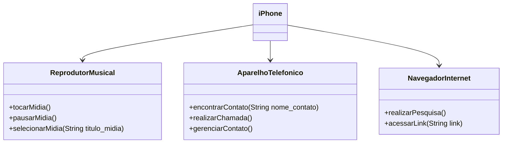

# trilha-java-umlPOO

```mermaid
classDiagram
    class ReprodutorMusical {
        +tocarMidia()
        +pausarMidia()
        +selecionarMidia(String titulo_midia)
    }

    class AparelhoTelefonico {
        +encontrarContato(String nome_contato)
        +realizarChamada()
        +gerenciarContato()
    }

    class NavegadorInternet {
        +realizarPesquisa()
        +acessarLink(String link)
    }

    class iPhone {
    }

    iPhone --> ReprodutorMusical
    iPhone --> AparelhoTelefonico
    iPhone --> NavegadorInternet

```
